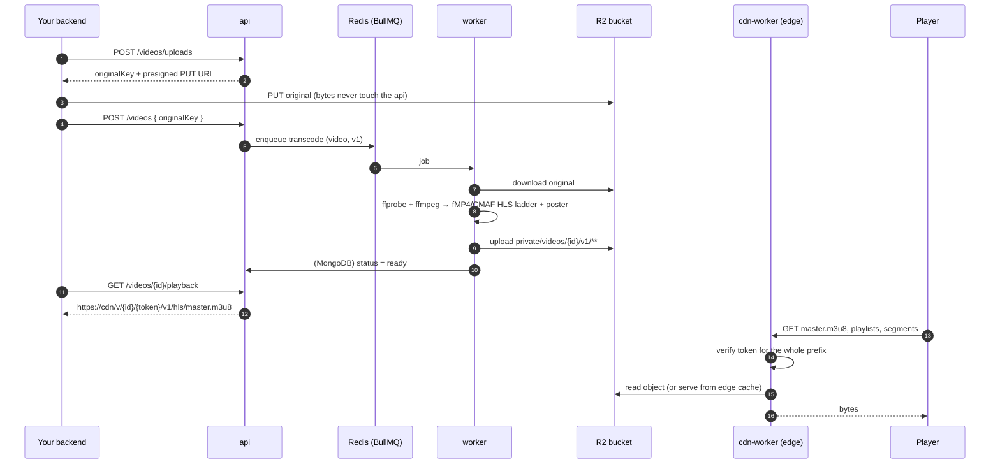

# r2-hls

Self-hosted adaptive video streaming on Cloudflare R2.

Upload a video, transcode it to an HLS ladder with ffmpeg, store the segments in
R2 and serve them privately through a small Cloudflare Worker — without using a
managed video product.

It is a pnpm/Turborepo monorepo with three deployables and a set of shared
packages:

| App | What it is | Stack |
| --- | --- | --- |
| [`apps/api`](apps/api) | Presigned uploads, video registration, signed playback URLs | NestJS, MongoDB, BullMQ |
| [`apps/worker`](apps/worker) | Queue consumer that transcodes originals into HLS and uploads them to R2 | NestJS (no HTTP), ffmpeg |
| [`apps/cdn-worker`](apps/cdn-worker) | Edge read path: validates tokens and streams objects out of R2 | Cloudflare Workers |

## Why

R2 has no egress fees, so storing HLS segments there and serving them from the
edge is cheap. What a managed video product adds on top is transcoding, access
control and a delivery URL scheme. This repository implements those three pieces
yourself: you pay for R2 storage and operations plus the compute that runs
ffmpeg, and in exchange you operate the pipeline.

Check Cloudflare's current terms for serving video before relying on this in
production.

## How it works



### One token for the whole ladder

An HLS stream is dozens of files: a master playlist, one playlist per quality
and a segment every two seconds. Signing each URL separately means rewriting
every playlist per viewer.

Here the token is a **path segment placed before the version**:

```
https://cdn.example.com/v/{videoId}/{token}/v{version}/hls/master.m3u8
                                    └──┬──┘
                       {expires}.{HMAC-SHA256("prefix:private/videos/{videoId}/v{version}/:{expires}")}
```

ffmpeg writes playlists with **relative** URIs (`360p/index.m3u8`,
`seg_00001.m4s`), so every request the player derives from the master playlist
keeps the same `/v/{videoId}/{token}/v{version}/` base. The playlists stored in
R2 are identical for every viewer and are never rewritten, and one signature
authorizes exactly one version of one video.

Three details make it cache-friendly:

- **Token-less cache key.** The cdn-worker authenticates every request, then
  looks the object up in the edge cache under its clean R2 path. A viewer with a
  different (or rotated) token still gets a cache hit.
- **Quantized expiry.** The API snaps `expires` to a 5-minute grid, so everyone
  who asks for the same video in the same window receives the *same* URL.
- **Versioned, immutable prefixes.** Objects live under
  `private/videos/{id}/v{n}/` and are served with
  `Cache-Control: public, max-age=31536000, immutable`. Re-transcoding writes
  `v{n+1}` and flips a pointer; nothing is ever purged or overwritten.

### Transcoding

A single ffmpeg invocation splits the decoded input and encodes every rung at
once ([`hls-variants.ts`](apps/worker/src/drivers/video/hls-variants.ts)):

- H.264 (main) + AAC, fMP4/CMAF segments, 2-second GOP-aligned keyframes with
  `independent_segments`, VOD playlists and a master playlist.
- A three-rung ladder (640 / 960 / 1280 px tall), keeping only the rungs the
  source can fill without upscaling by more than a third.
- A WebP poster taken from the first frame, so the poster-to-video handoff has
  no visible jump.

The video is marked `ready` only after every object has been uploaded, so a
playback URL never points at a half-written version.

## Repository layout

```
apps/
  api/          NestJS HTTP API           domain → application (use cases, ports) → drivers (adapters) → interface (controllers)
  worker/       NestJS application context, BullMQ processor + ffmpeg pipeline
  cdn-worker/   Cloudflare Worker (handlers, services, utils)
packages/
  contracts/    Framework-free domain, ports, queue names and the R2 key layout shared by api and worker
  database/     Mongoose model/mapper/repository for Media, Mongo and Redis connections
  logger/       Winston logger + NestJS LoggerModule (optional Datadog transport)
  config/       Env loading: .env files, then Google Secret Manager in production
  eslint-config/, tsconfig/   Shared lint and TypeScript bases
examples/
  hls-player.html   Static hls.js page to try a playback URL
```

Dependencies point one way: apps depend on packages, `database` depends on
`contracts`, and no app imports another app. Use cases depend on ports
(abstract classes used as injection tokens); the Mongo, BullMQ, R2 and HMAC
implementations are adapters wired in the NestJS modules. That is what lets the
test suite drive the real controllers and the real ffmpeg pipeline with
in-memory fakes instead of live infrastructure.

## API

All routes are under `/api/v1`, expect the shared secret in the `Authorization`
header (`VIDEO_INGEST_SECRET`) and return errors as RFC 7807
`application/problem+json`. They are meant to be called by your own backend,
which stays responsible for authorizing end users.

| Method | Path | Purpose |
| --- | --- | --- |
| `POST` | `/videos/uploads` | Reserve a key and get a presigned `PUT` URL (`video/mp4`, `video/quicktime`, `video/webm`) |
| `POST` | `/videos` | Register an uploaded original and enqueue its transcode |
| `GET` | `/videos/:id` | Processing status, dimensions, duration, error |
| `GET` | `/videos/:id/playback` | Signed HLS master playlist and poster URLs (`409` until ready) |
| `POST` | `/videos/:id/transcode` | Re-transcode the same original into a new version |
| `GET` | `/health` | Liveness |

Swagger UI is available at `/api/docs` outside production.

## Getting started

Requirements: Node 22+, pnpm 9, Docker (for MongoDB and Redis), ffmpeg and
ffprobe on `PATH`, and a Cloudflare account with an R2 bucket.

```bash
pnpm install
docker compose up -d
cp apps/api/.env.example apps/api/.env
cp apps/worker/.env.example apps/worker/.env
```

Fill in both `.env` files. For local development:

```
MONGO_URI=mongodb://localhost:27017/r2-hls
REDIS_HOST=localhost
R2_ACCOUNT_ID / R2_ACCESS_KEY_ID / R2_SECRET_ACCESS_KEY / R2_BUCKET   # an R2 API token with object read/write
R2_PUBLIC_URL=https://<your cdn-worker hostname>
HLS_TOKEN_SECRET / SIGNED_URL_SECRET / VIDEO_INGEST_SECRET            # long random strings
```

Deploy the edge Worker (set `bucket_name` in
[`wrangler.toml`](apps/cdn-worker/wrangler.toml) first), giving it the same two
secrets the API uses:

```bash
cd apps/cdn-worker
pnpm wrangler secret put HLS_TOKEN_SECRET
pnpm wrangler secret put SIGNED_URL_SECRET
pnpm run deploy
```

Browsers upload straight to R2, so the bucket needs a CORS rule allowing `PUT`
from your origin if you upload from a web page.

Run the API and the transcoding worker, then push a file through the pipeline:

```bash
pnpm dev
pnpm --filter @r2-hls/api upload:video ./sample.mp4 --title "Sample"
```

The script prints a signed `master.m3u8` URL. Open
[`examples/hls-player.html`](examples/hls-player.html) in a browser and paste
it in.

## Configuration

| Variable | Used by | Notes |
| --- | --- | --- |
| `MONGO_URI` | api, worker | |
| `REDIS_QUEUE_URL` or `REDIS_HOST` / `REDIS_PORT` / `REDIS_PASSWORD` / `REDIS_QUEUE_DB` | api, worker | BullMQ connection; `REDIS_QUEUE_PREFIX` defaults to `bull` |
| `R2_ACCOUNT_ID`, `R2_ACCESS_KEY_ID`, `R2_SECRET_ACCESS_KEY`, `R2_BUCKET` | api, worker | S3-compatible credentials |
| `R2_PUBLIC_URL` | api | Base URL of the cdn-worker |
| `HLS_TOKEN_SECRET` | api, cdn-worker | Must be identical on both sides |
| `HLS_TOKEN_TTL_SECONDS`, `HLS_TOKEN_BUCKET_SECONDS` | api | Defaults: 1800 and 300 |
| `SIGNED_URL_SECRET` | api, cdn-worker | Per-file signed URLs under `/private/*` |
| `VIDEO_INGEST_SECRET` | api | Shared secret for the video endpoints |
| `VIDEO_MAX_DURATION_SECONDS` | worker | Default 90; longer inputs fail |
| `WORKER_CONCURRENCY`, `FFMPEG_THREADS` | worker | Keep `concurrency × threads` near the core count |
| `ALLOWED_ORIGINS` | cdn-worker | Comma-separated CORS allow-list; any origin when unset |
| `APP_ENV`, `APP_NAME`, `GOOGLE_CLOUD_PROJECT` | api, worker | With `APP_ENV=prod`, secrets named `prod--{APP_NAME}--{VAR}` are loaded from Google Secret Manager |
| `DATADOG_KEY` | api, worker | Optional log shipping in production |

## Testing

```bash
pnpm test        # all packages
pnpm lint
pnpm typecheck
```

- **api** (Jest): the token and signed-URL formats, media resolution rules, the
  use cases against in-memory ports, and HTTP-level tests that run the real
  controller, guard, validation pipe and error filter.
- **worker** (Jest): the ladder selection and ffmpeg argument builder, plus an
  integration test that transcodes a generated clip with the real ffmpeg and
  checks the resulting playlists, segments, upload order and failure handling.
  It is skipped when ffmpeg is not installed.
- **cdn-worker** (Vitest): the Worker's `fetch` handler end to end against an
  in-memory bucket and cache — token validation, cross-video and cross-version
  rejection, path traversal, range requests and cache behavior. Tokens are
  minted the same way the API mints them, which pins the contract between the
  two services.

## Limitations

- A token is a bearer credential: anyone holding the URL can watch until it
  expires. There is no DRM and no per-viewer revocation.
- The API authenticates callers with a single shared secret. It is a backend
  building block, not a public-facing API.
- The ladder is fixed and tuned for short vertical video (default 90-second
  cap, rungs defined by height). Other shapes work but are not optimized.
- A presigned `PUT` cannot enforce a maximum size; an oversized or invalid
  upload is only rejected when the worker probes it.
- H.264/AAC only. No captions, alternate audio tracks, thumbnail sprites or
  live streaming.
- Old versions and originals are never deleted; lifecycle cleanup is left to R2
  lifecycle rules.

## License

[MIT](LICENSE)
